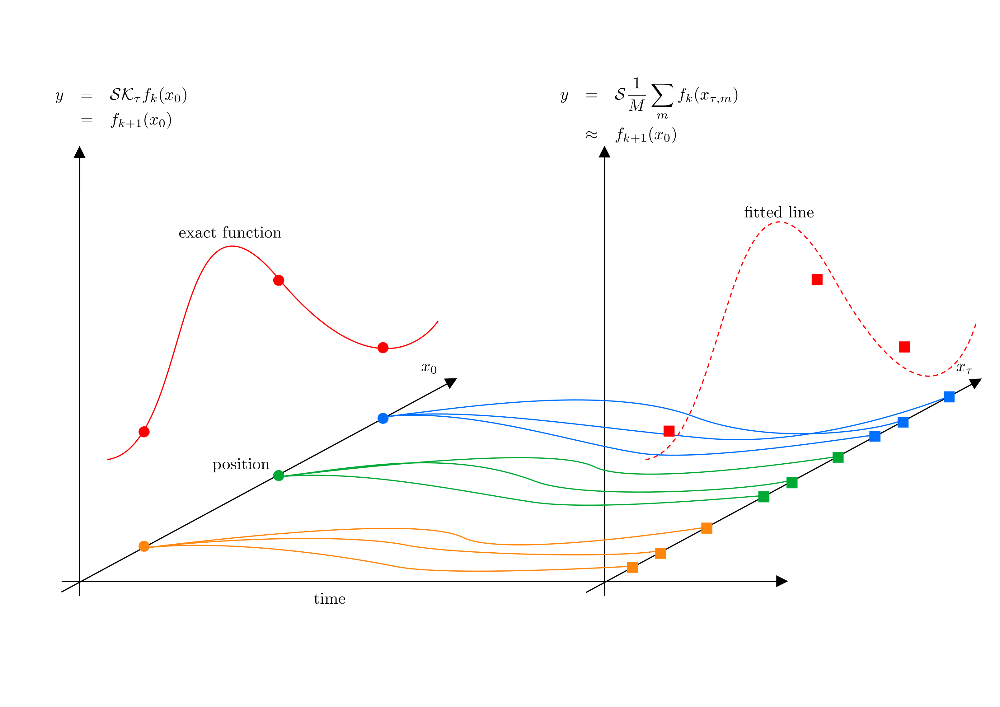

# ISOKANN.pytorch
ISOKANN is an algorithm that uses machine learning techniques to identify invariant subspaces of the Koopman operator. 

Here, you can find several examples of the method based on the original ISOKANN version described in Ref. [1] and summarized in Ref. [2].
In Refs. [3,4], you can find more information and applications of ISOKANN.

The code collected in this repository is intended primarily for teaching purposes. For more advanced work, we suggest using [the Julia version](https://github.com/axsk/ISOKANN.jl) developed by [Alexander Sikorski](https://www.zib.de/members/sikorski).

The following notebook shows how to implement ISOKANN in a simple and effective manner for a one-dimensional system, and is intended for teaching purposes.

### References

[1] R. J. Rabben, S. Ray, M. Weber; ISOKANN: Invariant subspaces of Koopman operators learned by a neural network.
[J. Chem. Phys. 153, 114109 (2020)](https://pubs.aip.org/aip/jcp/article-abstract/153/11/114109/199583/ISOKANN-Invariant-subspaces-of-Koopman-operators)

[2] L. Donati; [Notes about ISOKANN algorithm](https://www.zib.de/userpage/donati/SeminarSOSE2024/06/lecture_notes/L06.pdf)

[3] A. Sikorski, E.R. Borrell, M. Weber; Learning Koopman eigenfunctions of stochastic diffusions with optimal importance sampling and ISOKANN. [J. Math. Phys. 65, 013502 (2024)](https://pubs.aip.org/aip/jmp/article/65/1/013502/2933145/Learning-Koopman-eigenfunctions-of-stochastic)

[4] Donati L., 2024: The Kramers turnover in terms of a macro-state projection on phase space. [Mol. Phys, e2356748](https://www.tandfonline.com/doi/full/10.1080/00268976.2024.2356748?src=exp-la)
